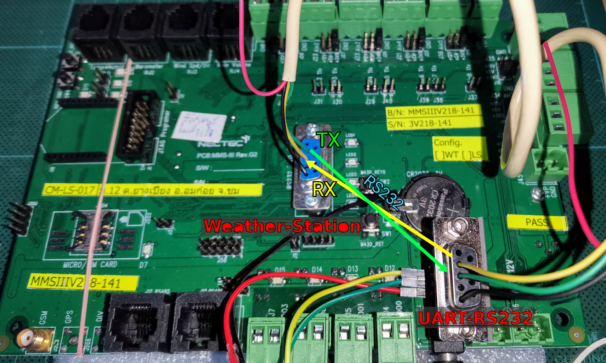

# Multihop LoRa with TTGO-T-Beam

This project tries to implement multihopping data relay on the network of ESP32 modules
  -- _TTGO-T-Beam_ nodes.
It uses flood routing from the project: [Flood Routing with Motelib](https://github.com/iPAS/motelib_flooding.git).


## Quick Start


### Hardware Assembly

#### Connect T-Beam with UART-RS232

The firmware uses UART2 for communicating with the weather station through
    [UART-232 module](https://www.aliexpress.com/item/696400942.html?spm=a2g0o.cart.0.0.79333c009rHjfp&mp=1),
    while UART0 and UART1 are used for debugging and connecting with GPS respectively.
The signal pins between the two modules are connected as following:

* [T-Beam].2  (TXD2)  <-->  [UART-232].TXD
* [T-Beam].13 (RXD2)  <-->  [UART-232].RXD
* [T-Beam].GND        <-->  [UART-232].GND
* [T-Beam].5V         <-->  [UART-232].VCC


#### Connect T-Beam with Weather Station through UART-RS232

__Board__ of [the weather station](https://www.nectec.or.th/clipping/news/2009-11-05-5069.pdf) 
    sends data through __DB9 connector__.
__T-Beam__ receives the data with the transceiver board, __UART-232 module__.
The DB9 pins are connected as following: 

* [station].2 (TX232)  <-->  [UART-232].3 (RX232)
* [station].3 (RX232)  <-->  [UART-232].2 (TX232)
* [station].5 (GND)    <-->  [UART-232].5 (GND)




### Firmware

* Use __Vscode__ plus __[Arduino extension](
    https://marketplace.visualstudio.com/items?itemName=vsciot-vscode.vscode-arduino)__
    to open the project in directory _src_.
* Compile and flash into a T-Beam board without any re-configuration. 
    The code will automatically dectect revision of the board.
* At runtime, pass a command to _set id as 0_ for the node connected to the gateway device.
* The work flow is explained in the [next section](#how-formware-work).


## System Overview


### How Firmware Work

1. After booting, a __T-Beam node__ will be waiting data passed from its attached __weather station__.
2. If the data is available through __UART2__,
    the node sends it out via the [routing protocol](#routing)
    to the __sink node id 0__ which is determined to be connected to the __gateway__.
3. The sink node sends out the data it received, to the gateway through __UART0__ -- debugging port.


### Routing

* Project that is provided the [routing mechanism](https://github.com/iPAS/motelib_flooding).

[](https://youtu.be/CcUM0YgV6Vg?t=35s "Multi-source/Hybrid Test")


### Terminal Commands

On purpose, these commands could be send to T-Beam through __UART0__, debugging port.

* ```help``` for listing all commands.
* ```hello``` for testing only.
* ```node_id``` for setting node id, e.g., 
    * ```node_id``` for asking the current node id.
    * ```node_id <id>``` for setting the new id where <id> in [0..25535].
* ```vtube <params>``` for forwarding data through UART2.


## TTGO-T-Beam


### Pinout

#### Rev.0.7


#### Rev.1.0


#### Rev.1.1


### Resources

#### Hardware References

* [All versions' schematics](https://github.com/Xinyuan-LilyGO/LilyGO-T-Beam)
* [V0.7 information](https://tinymicros.com/wiki/TTGO_T-Beam)

* [LiLy TTGO T-Beam 0.7](http://www.lilygo.cn/prod_view.aspx?TypeId=50033&Id=1237&FId=t3:50033:3)
* [LiLy TTGO T-Beam 1.1](http://www.lilygo.cn/claprod_view.aspx?TypeId=62&Id=1281&FId=t28:62:28)

* [SoftRF](https://github.com/lyusupov/SoftRF/wiki/Prime-Edition-MkII)

#### Examples

* [Examples for each peripheral on T-Beam](https://github.com/Xinyuan-LilyGO/LilyGo-LoRa-Series)

* [Low-power design guide for T-Beam](https://github.com/JoepSchyns/Low_power_TTGO_T-beam)
* [Most comprehensive resource on Riot-OS website](https://doc.riot-os.org/group__boards__esp32__ttgo-t-beam.html)

* [SPI Bug Fix on Sendeepmistry's LoRa Library](https://github.com/eduautomatiza/arduino-LoRa/commit/6d1d8e48d216c24618c9d230c795160a00f510dd) -- reconfirmed with [Arduino SPI Library](https://www.e-tinkers.com/2020/03/do-you-know-arduino-spi-and-arduino-spi-library/)
