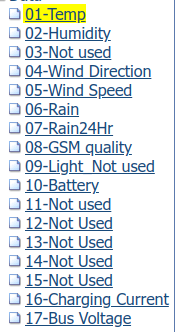

## Quick Start

1. At /home/pi, `$ ln -sf /home/pi/TTGO-T-Beam_Multihop/tools/log_serial`.
  So, __/home/pi/log\_serial__ will exist, then:
	- `$ cd ~/log_serial`
	- `$ ./setup.sh`

2. Go to /etc/monit/conf.d, then:
	- `$ ln -sf /home/pi/log_serial/log_serial.monit`
	- `$ sudo service monit restart`
	- `$ sudo monit start log_serial`

3. Give a permission to execute:
	- `$ sudo visudo` then
		```
		# User privilege specification
		root    ALL=(ALL:ALL) ALL

		# Allow members of group sudo to execute any command
		%sudo   ALL=(ALL:ALL) ALL
		```
	- `$ echo 'pi ALL=(ALL) NOPASSWD: ALL' | sudo tee /etc/sudoers.d/010_pi-nopasswd`

4. Setup uploading schedule:
	- `$ crontab -e`
	- Enter `59 */8 * * * /home/pi/log_serial/log_upload.sh >/tmp/log_upload.log`


## Note


